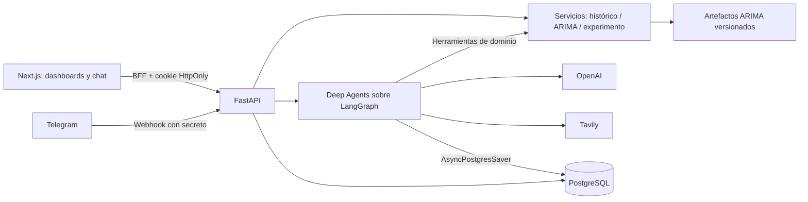

# Arquitectura

Una sola API comparte servicios entre HTTP, web y herramientas del agente. No se hacen llamadas HTTP circulares a sí misma: herramientas y endpoints ejecutan las mismas funciones y validaciones. Next.js actúa como BFF y proxy de streaming, sin secretos en `NEXT_PUBLIC_*`.

Las conversaciones tienen un propietario estable por sesión o Telegram y un rol fijo. Cada turno mantiene un bloqueo de PostgreSQL por propietario, con cuota persistente y eventos separados de la respuesta. El checkpointer recibe el ID autorizado por el servidor.

La búsqueda web es contenido no confiable: no modifica el rol, el prompt ni los permisos. Sus resultados se citan y no sustituyen las proyecciones locales. El agente tiene herramientas de lectura y backend virtual; se excluyen ejecución de shell, filesystem y subagentes genéricos.

El contexto resumido del experimento está en `backend/data/context.md`. `consultar_oportunidades` calcula rankings con el mismo ARIMA que el endpoint, reservada al agente interno. Un bloqueo por propietario serializa turnos y cuota entre sus conversaciones; cuatro turnos por proceso reservan conexiones para herramientas.
